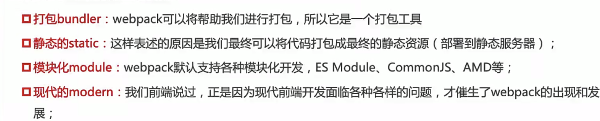

# webpack5 静态模块化打包工具

> webpack is a <font color="red">static module bundler </font>for <font color="red">modern</font> Javascript applications




# Vue 处理场景
 ## Javascript 的打包
 1. ES6 转成 ES5
 2. Typescript 的处理，将其转换成 Javascript

 ## Css 的处理
 1. CSS 文件模块的加载、提取
 2. Less、Sass 等预处理器的处理

 ## 资源文件 img、font
1. 图片 img 文件的加载
2. 字体 font 文件的加载

## HTML 资源的处理
1. 打包 HTML 资源文件


## 处理 vue 项目的 SFC 文件.vue 文件  


# Webpack 的安装
推荐局部安装，不同项目可以使用不同版本
webpack 安装： webpack、webpack-cli
那么他们是什么关系呢？  
执行 webpack 命令，会执行 node_modules 下的 .bin 目录下的 webpack;
webpack 在执行时是依赖 webpack-cli 的，如果没有安装就会报错
而webpack-cli中代码执行时，才是真正利用 webpack 进行编译和打包的过程
所以在安装 webpack 时，我们需要同时安装 webpack-cli（第三方脚手架是没有用 webpack-cli 的，而是自带类似 vue-service-cli）


## 管理包依赖 （webpack）
npm init 或者 npm init -y 生成 package.json

npm i  webpack、webpack-cli -D

package-lock.json 记录安装的版本号

### 局部运行 webpack 的命令：
```
$./node_modules/.bin/webpack
    等价于
$npx webapck 
npx webapck --entry ./src/main.js --outpuy-path ./build
    等价于
package.json
    "scripts":{"build":"webpack"}
     "scripts":{"build":"webpack --entry ./src/main.js"}
$npm run build (默认在当前所在目录 src/index.js 进行打包)

```

### 指定配置文件的名称：
    "scripts":{"build":"webpack --config why.config.js"}
  

# webpack 依赖图

# loader


## 处理 css、 style-loader、css-loader、less-loader
js 中引入 import "./css/style.css" 报错
    需要对应的 loader 
   . css 文件的 loader

### 内联方式
import "style-loader!css-loader!less-loader!../css/style.css";

### 配置方式
modules:{
    rules:[{
        test:/\.css$/, //正则匹配
        <!-- 从右往左执行 -->
        use:["style-loader","css-loader",{
            loader:'postcss-loader',
            options:{
                postcssOptions:{
                    plugins:[
                        require("autoprefixer")
                    ]
                }
            }
        }]
    },{
        test:/\.less$/, //正则匹配
        <!-- 从右往左执行 -->
        use:["style-loader","css-loader",{
            loader:'postcss-loader',
            options:{
                postcssOptions:{
                    plugins:[
                        require("autoprefixer")
                    ]
                }
            }
        },'less-loader']
    }]
}


## 处理图片 file-loader
npm install file-loader -D

```js
{
    test:/\.(png|jpe?g|gif|svg)$/i,
    use:{
        // loader:'file-loader',
        loader:'file-loader',
        options:{
            outputPath:'img',// 打包目录下的文件目录名称
            name:"[name]_[hash:6].[ext]" //图片名称 
    
        }
    }
}
```

## url-loader 减少请求数量
npm install url-loader -D
```js
{
    test:/\.(png|jpe?g|gif|svg)$/i,
    use:{
        // loader:'file-loader',
        loader:'url-loader',
        options:{
            name:"[name]_[hash:6].[ext]" //图片名称 
            limit:100 *1024     //小于100kb
        }
    }
}
```

## 资源模块类型 （asset module type） webpack5 开始
<!-- 不需要安装loader -->
asset/resource 替代 file-loader
asset/inline   替代 url-loader
asset/source   替代 raw-loader
```js
{
    test:/\.(jpe?g|png|gif|svg)$/,
    type:"asset/resource"
}
{
    test:/\.(jpe?g|png|gif|svg)$/,
    type:"asset",
    generator:{
        filename:"img/[name]_[hash:6][ext]"
    },
    parser:{
        dataUrlCondition:{
            maxSize: 100*1024
        }
    }
}

```


# 插件（loader 做不了的事情）

## 清除打包的文件 CleanWebpackPlugin
npm install clean-webpack-plugin -D

## 打包 HTML HtmlWebpackPlugin
npm install html-webpack-plugin -D

## CopyWebpackPlugin

## 删除打包后的文件夹


# 页面中  
## less --> css  (less compiler)   
```
npm install less -g
npx lessc ./test.less demo.css
```

## postcss
```
npm install postcss postcss-cli -g
npm install autoprefixer -D

npx postcss --use autoprefixer -o end.css ./src/css/style.css
```


